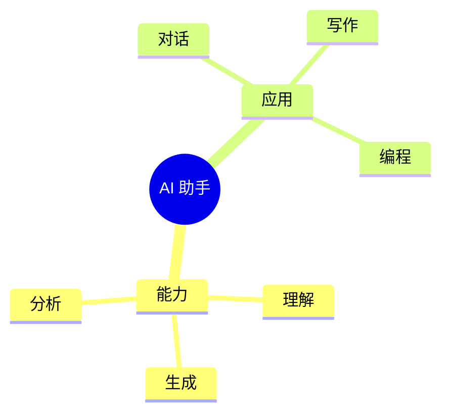
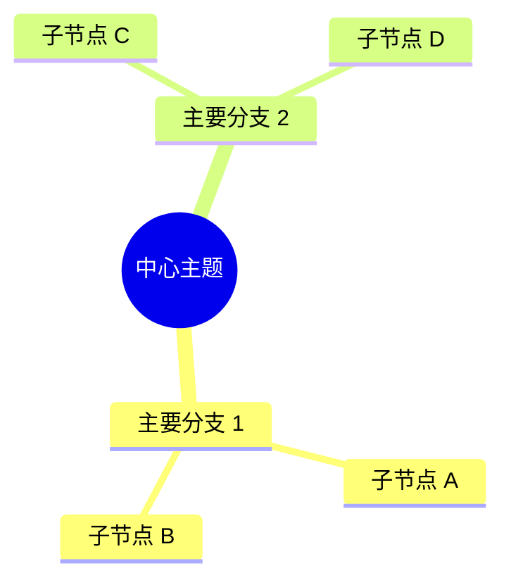
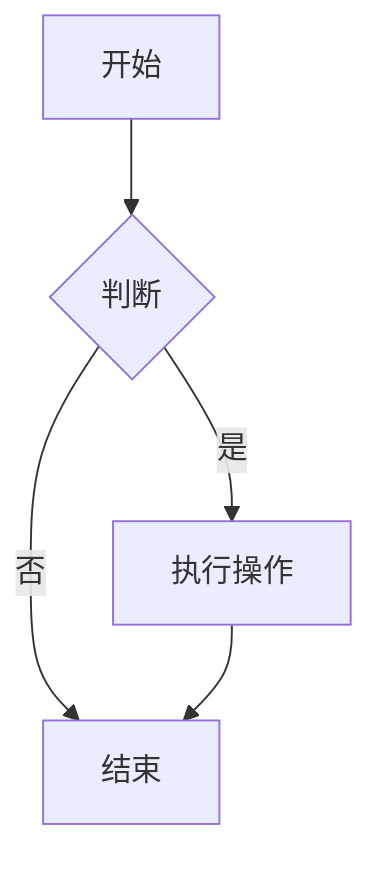
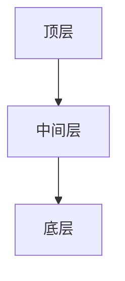

# 📸 图片插入功能使用指南

本功能允许你在材料模板填充时**自动生成并插入图片**（如思维导图、流程图等）。

---

## 🎯 功能概述

### 支持的图表类型

1. **思维导图 (Mindmap)** - 从 Mermaid 文本或结构化内容生成
2. **流程图 (Flowchart)** - 从流程描述生成
3. **金字塔图 (Pyramid)** - 从层级结构生成

### 生成方式

- **方式 1**: 使用 Graphviz (DOT) - 推荐 ✅
- **方式 2**: 使用 Mermaid CLI
- **方式 3**: 使用 step 工具分析文本后生成

---

## 📦 前置要求

### 1. 安装 Graphviz（推荐）

**Ubuntu/Debian:**
```bash
sudo apt-get install graphviz
```

**macOS:**
```bash
brew install graphviz
```

**Windows:**
- 下载安装：https://graphviz.org/download/
- 添加到系统 PATH

### 2. 安装 step 工具（可选）

```bash
cd /path/to/step_extracted/step
pip install -e .
```

### 3. 安装 Pillow（用于图片处理）

```bash
pip install pillow
```

---

## 💡 使用方法

### 方法 1: 在 Python 脚本中使用

```python
from docx_filler_v3 import DocxFillerV3

# 创建填充器
filler = DocxFillerV3('template.docx', 'output.docx')

# 1. 填充文本内容
filler.fill(user_input)

# 2. 插入思维导图
mermaid_content = """
mindmap
  root((核心主题))
    分支 1
      子节点 A
      子节点 B
    分支 2
      子节点 C
"""

filler.insert_mindmap(
    mermaid_content=mermaid_content,
    caption="图 1: 项目结构思维导图",
    method='dot'  # 使用 Graphviz
)

# 3. 保存文档
filler.doc.save('output.docx')
```

### 方法 2: 从文本自动生成图表

```python
from docx_filler_v3 import DocxFillerV3

filler = DocxFillerV3('template.docx', 'output.docx')

# 从文本分析并生成思维导图
text = """
本方案包含三个核心模块：
1. 数据采集模块 - 负责传感器数据收集
2. 数据处理模块 - 进行数据清洗和分析
3. 数据展示模块 - 可视化展示结果
"""

filler.generate_and_insert_diagram(
    text=text,
    diagram_type='mindmap',
    caption="图 1: 系统架构"
)

filler.doc.save('output.docx')
```

### 方法 3: 使用测试脚本

```bash
cd /path/to/material-template-filler/scripts

# 运行测试
python test_image_insert.py
```

---

## 🔧 API 参考

### `insert_image(image_path, caption=None, width=15.0)`

在文档末尾插入图片。

**参数:**
- `image_path`: 图片文件路径（PNG/JPG）
- `caption`: 图片说明文字（可选）
- `width`: 图片宽度（厘米，默认 15cm）

**返回:** 是否插入成功 (bool)

**示例:**
```python
filler.insert_image(
    'diagram.png',
    caption="图 1: 系统架构图",
    width=18.0
)
```

---

### `insert_mindmap(mermaid_content, caption=None, output_path=None, method='dot')`

生成并插入思维导图。

**参数:**
- `mermaid_content`: Mermaid 格式的思维导图定义
- `caption`: 图片说明文字
- `output_path`: 输出 PNG 路径（可选，默认临时文件）
- `method`: 生成方法 ('dot' 或 'mermaid')

**返回:** 是否插入成功 (bool)

**Mermaid 格式示例:**


---

### `generate_and_insert_diagram(text, diagram_type='mindmap', caption=None)`

从文本自动生成图表并插入。

**参数:**
- `text`: 要分析的文本内容
- `diagram_type`: 图表类型 ('mindmap', 'flowchart', 'pyramid')
- `caption`: 图片说明文字

**返回:** 是否插入成功 (bool)

**示例:**
```python
text = """
项目分为三个阶段：
第一阶段：需求分析和设计
第二阶段：开发和测试
第三阶段：部署和维护
"""

filler.generate_and_insert_diagram(
    text=text,
    diagram_type='mindmap',
    caption="图 1: 项目阶段"
)
```

---

## 📝 Mermaid 语法快速参考

### 思维导图 (Mindmap)



### 流程图 (Flowchart)



### 金字塔图 (Pyramid)



---

## ⚠️ 常见问题

### 1. "图片生成器不可用"

**原因:** 缺少依赖库或 Graphviz

**解决:**
```bash
# 安装 Graphviz
sudo apt-get install graphviz  # Ubuntu/Debian
brew install graphviz  # macOS

# 安装 Python 库
pip install pillow
```

### 2. "dot 命令失败"

**原因:** Graphviz 未正确安装或不在 PATH 中

**解决:**
- 检查安装：`which dot` 或 `dot -V`
- 添加到 PATH（Windows）：`setx PATH "%PATH%;C:\Program Files\Graphviz\bin"`

### 3. 图片太大或太小

**解决:** 调整 `width` 参数：
```python
filler.insert_image('diagram.png', width=20.0)  # 20cm 宽
```

### 4. 中文显示乱码

**解决:** 确保系统有中文字体，或在 Mermaid 中指定字体：


---

## 🎯 最佳实践

### 1. 在模板中预留图片位置

在 Word 模板中使用占位符：
```
[在此处插入思维导图]
{{image:mindmap}}
```

### 2. 使用清晰的 Mermaid 结构

```mermaid
# ✅ 好的结构
mindmap
  root((清晰的主题))
    分类 1
      具体的子节点
    分类 2
      具体的子节点

# ❌ 避免过深的层级
mindmap
  root((主题))
    分支
      子分支
        孙分支
          曾孙分支  # 太深了！
```

### 3. 添加有意义的说明

```python
filler.insert_mindmap(
    mermaid_content,
    caption="图 1: 系统架构思维导图（展示核心模块和关系）"
)
```

### 4. 测试不同生成方法

```python
# 尝试不同方法
success = filler.insert_mindmap(content, method='dot')
if not success:
    success = filler.insert_mindmap(content, method='mermaid')
```

---

## 📚 相关资源

- [Mermaid 官方文档](https://mermaid.js.org/)
- [Graphviz 官网](https://graphviz.org/)
- [Mermaid Live Editor](https://mermaid.live/) - 在线编辑和预览

---

## 🔗 集成到现有流程

### 在 `run_v2_example.py` 中使用

```python
from docx_filler_v3 import DocxFillerV3

# ... 现有代码 ...

filler = DocxFillerV3(template_path, output_path)
filler.fill(user_input)

# 新增：插入思维导图
if should_insert_mindmap:
    filler.insert_mindmap(mermaid_content, caption="思维导图")

filler.add_fill_report()
filler.doc.save(output_path)
```

---

**最后更新:** 2026-03-24
**版本:** 1.0
